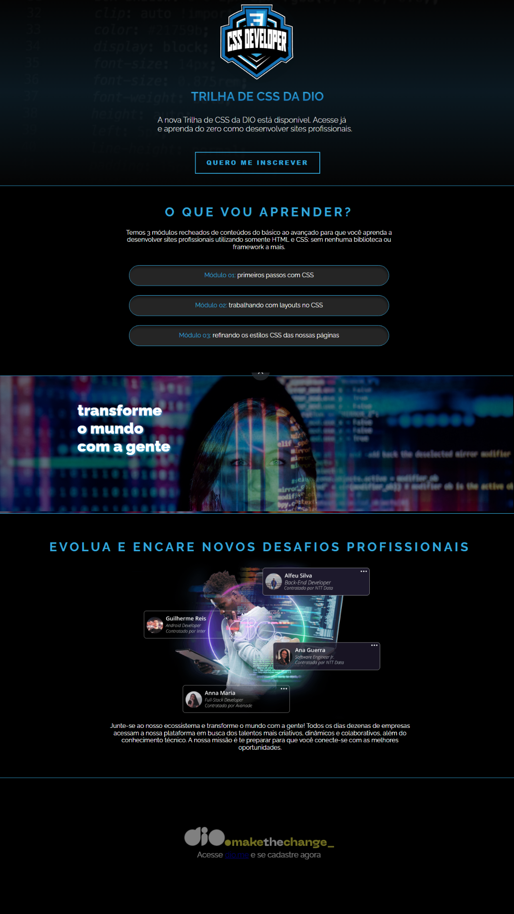

# Landing page Trilha de CSS da Dio._

### Tópicos 

[Descrição do projeto](#descrição-do-projeto)

[Funcionalidades](#funcionalidades-do-projeto)

[Ferramentas utilizadas](#tecnologias-e-conceitos-utilizados)

# Descrição do projeto
Um site do tipo landing page criado para a entrega do desafio de projeto da Digital Innovation One. 

## Funcionalidades do projeto
- `Funcionalidade 1:` Apresentar a nova trilha de CSS da Digital Innovation One.

## Tecnologias e conceitos utilizados:
- HTML 
- CSS 
- Figma